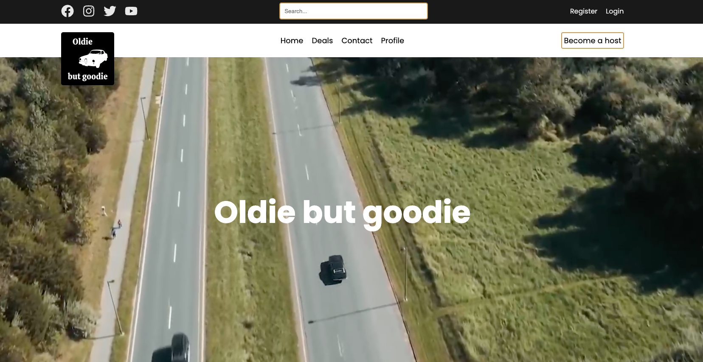
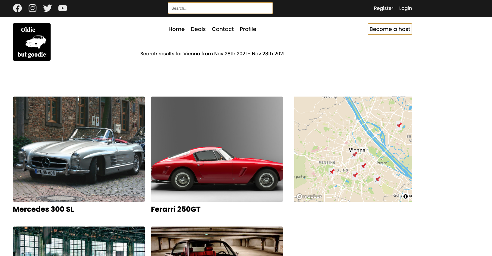
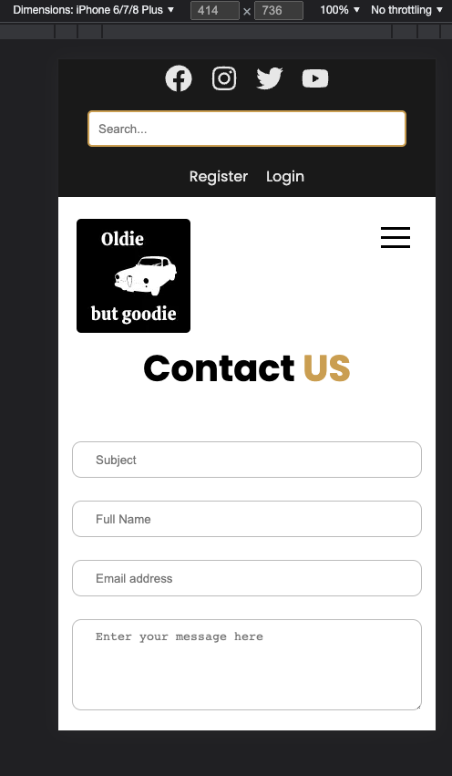
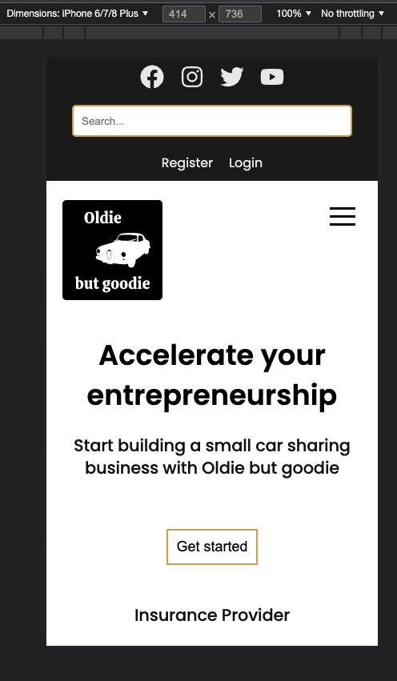

This is a [Next.js](https://nextjs.org/) project bootstrapped with [`create-next-app`](https://github.com/vercel/next.js/tree/canary/packages/create-next-app).

## Description

Oldie but goodie gives budding entrepreneurs the tools and resources they need to build a small, successful portfolio of cars to share on the marketplace, and the opportunity to add thousands to their annual income.

List your first car now to get started, then build your business plan and scale how you want!

## Functionalities

- User authentication (registration + login)
- Registered users are able to add their own car to the page.
- A user can edit and delete their Ad
- The website is fully responsive, so access on the mobile phone is possible
- User authorization (only the owner of items is allowed to modify or delete Ad
  and to see private account details)
- The website is fully responsive, so access on the mobile phone is possible
- Functional Contact Form

## Technologies

- Next.js
- React.js
- PostgreSQL
- Emotion
- TypeScript
- Cypress tests







## Getting Started

First, run the development server:

```bash
npm run dev
# or
yarn dev
```

Open [http://localhost:3000](http://localhost:3000) with your browser to see the result.

You can start editing the page by modifying `pages/index.js`. The page auto-updates as you edit the file.

[API routes](https://nextjs.org/docs/api-routes/introduction) can be accessed on [http://localhost:3000/api/hello](http://localhost:3000/api/hello). This endpoint can be edited in `pages/api/hello.js`.

The `pages/api` directory is mapped to `/api/*`. Files in this directory are treated as [API routes](https://nextjs.org/docs/api-routes/introduction) instead of React pages.

## Learn More

To learn more about Next.js, take a look at the following resources:

- [Next.js Documentation](https://nextjs.org/docs) - learn about Next.js features and API.
- [Learn Next.js](https://nextjs.org/learn) - an interactive Next.js tutorial.

You can check out [the Next.js GitHub repository](https://github.com/vercel/next.js/) - your feedback and contributions are welcome!

## Deploy on Vercel

The easiest way to deploy your Next.js app is to use the [Vercel Platform](https://vercel.com/new?utm_medium=default-template&filter=next.js&utm_source=create-next-app&utm_campaign=create-next-app-readme) from the creators of Next.js.

Check out our [Next.js deployment documentation](https://nextjs.org/docs/deployment) for more details.
